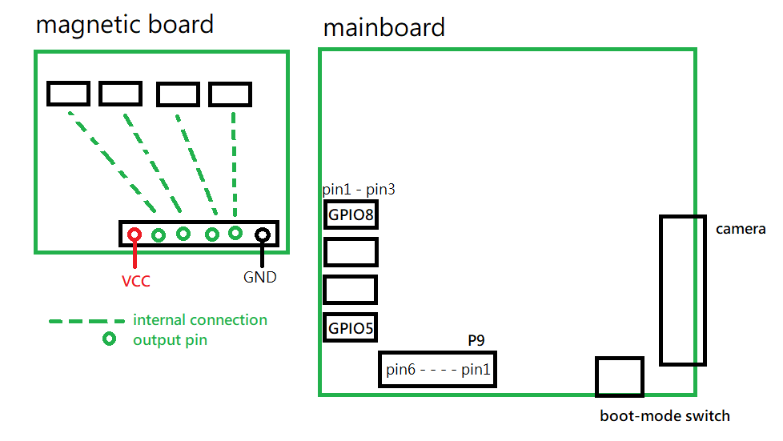

# Connection
This part will teach you about how to connect the magnetic board(the new smaller board) to the mainboard. 
You should notice that there are a few different names we use for **DIFFERENT** things: *pins*, *channels* and *ports*. 

For *pins*, it is talking about the golden metal *pins* coming out of the board.  
For *channels*, we are talking ablut the internal wiring of the board, aka where the pins is connected to(inside the board).  
For *ports*, we are talking about the group of *pins* that is grouped together with the black header.  

*AND* we got 2 boards now, the smaller one we called it *magnetic board* and for the larger one(that you used before) we called it *main board*.
Notice that the magnetic board you will use in the competition would be a different one than the one you used in the tutorial.

You can use a maximum of 8 inductors in the competition. For P9, it is designed for you to use ADC. And for GPIO5-8, it can be used 
for other functions and the output voltage is 5V. However, you should use a 3.3V as a input for the magnetic board. Therefore, even though 
you are using GPIO ports, use the input from P9. 
*Notice that the GND for both is different too. But that only makes minor difference.*

## Seeing if the code works or not
One easy way to check if your program works or not is simply disconnect the input from the magnetic board to mainboard. 
(By disconnecting the sensor/inductor or disconnect the signal wire.)  
When there is no connection, the output should be around the maximum value of 12bits(what is it?). When the sensor is connected, the value 
would be a small number(~100) as it picks up little signal(where does it come from?).  
After you get the code right, you could go out to the copper wire to see the change in the sensor output.

## Why my code doesn't work?
There are usually a few reasons:
* You use the wrong channel. Check the pin you are conneted to and what is its channel number.
* You init the adc wrongly. Remember adc_init() is put after adc_channel_init().
* The board has problem. Ask a senior to help you check for it. 
