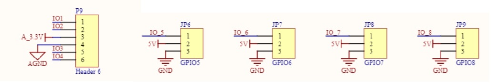

# Advanced Tutorial #2 - Image processing and magnetic sensor
## Magnetic Sensor (Inductor)
### Set up of competition environment
The magnetic track consists of one insulated copper wire with its 2 ends connected to a signal genereator. The signal generator will provide a 100mA AC(Alternating Current) with 20kHz frequency (with some tolerance on the actual values).


When there is current, it will generate a magnetic field according to the left hand rule.
### How inductor works


The inductor is actually just a circular coil of wire. The varying magnetic field will induce emf to the coil to produce an opposing magnetic field. The induced emf  would be inversely proportional to the distance  between the wire and the inductor.
Other than the position of the inductor, the angle of the inductor relative to the wire also matters to the magnitude of induced emf since it can only induce emf when the coil **cuts through** the magnetic field. Simply put, assuming the position of the coil didn't moved, when the coil is **parallel** to the signal wire, it will **not** pick up any singal from the wire. And when it is **perpendicular** to the signal wire, the induced emf should be at its **maximum**. When you rotate the coil from 0deg to 90deg, the induced emf should be a sin curve.

Here we take  as the angle between the coil and the magtic field,   and  to be the vertical and horizontal distance between the coil and the wire.


### How ADC works
The induced emf will be passed to ADC (analog-to-digital converter) after hardware magification. The ADC would convert the signal to a 12-bit numerical representation by comparing it with a reference voltage. For our magnetic board, the reference voltage is 3.3V. 

### Using ADC
Here is the library functions that you have to use for getting ADC values.
#### *Definition of ADC Pins*
```C
extern ADCPort ADC_CH1,ADC_CH2,ADC_CH3,ADC_CH4,ADC_CH5,ADC_CH6,ADC_CH7,ADC_CH8;
#define ADC_IO_1 &ADC_CH1
#define ADC_IO_2 &ADC_CH2
#define ADC_IO_3 &ADC_CH3
#define ADC_IO_4 &ADC_CH4
#define ADC_IO_5 &ADC_CH5
#define ADC_IO_6 &ADC_CH6
#define ADC_IO_7 &ADC_CH7
#define ADC_IO_8 &ADC_CH8
```
There is a maximum of 8 ADC channels provided. That means you can use up to 8 inductors to collect readings.
The ADC_IO_x are in ADCPort* variable type already, as needed for all following functions. Therefore, you can use them for the ADC functions directly.

#### *Initialize ADC channels*
```C
void adc_channel_init(ADCPort* adc_port);
```
While there are named 1 to 8 in the software side. The labeling on the board is different. There are named GPIO5-8 and P9 on the board. You can see which channel they are referred to from the schematics(the image below or F1_Internal_201819/PDFs/Schematic.pdf). 


*Advice: Use the pins from P9 for easier cable management.*
#### *Initialize ADC*
```C
void adc_init(void);
```
After you initialise individual channels. You initialise the whole ADC. Note that you should do this *AFTER* `adc_channel_init();`. You should be able to get values from ADC afterwards.

#### *Get value from ADC channels*
```C
u16 get_adc(ADCPort* adc_port);
```
Notice the return type is u16(i.e. unsigned 16 bits). 

### Classwork
1. Why the data we get from the sensor isn't 0 even though it's far away from the signal wire?
2. The ADC changes analog signal to digital form. What would be the return value from ADC if we give 1V to it?
3. (Demo) Move the inductor around the signal wire to show the change in sensor data. (Output the data on the lcd.)
4. (Demo) Give your idea on inductor positions for internal competition. Provide reasons for that.
